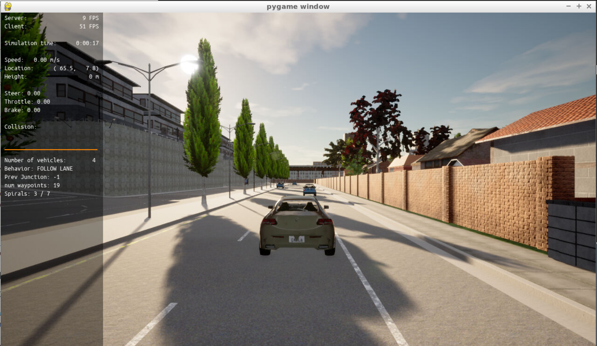
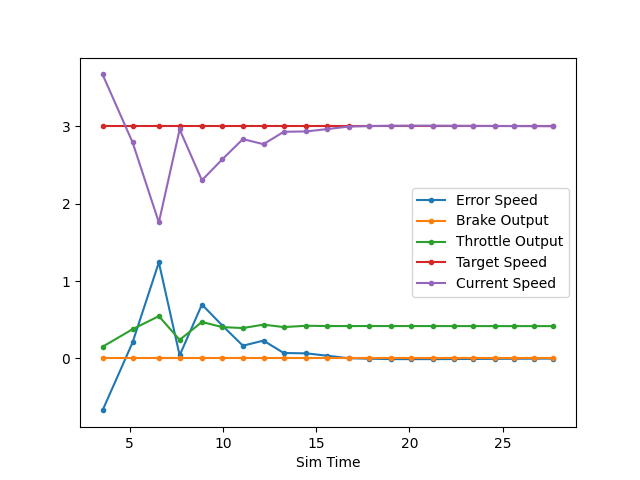
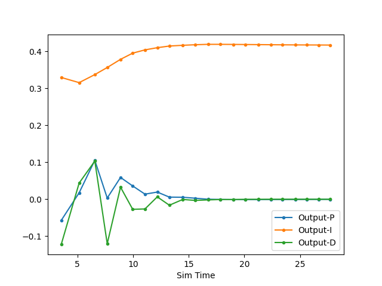
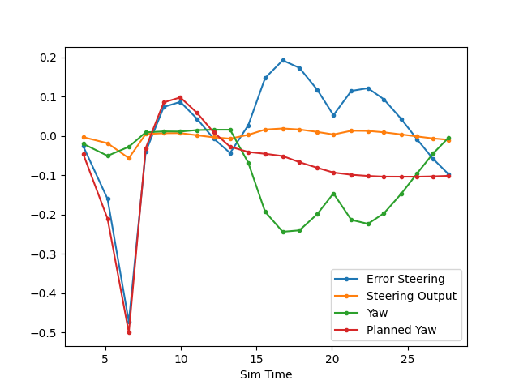
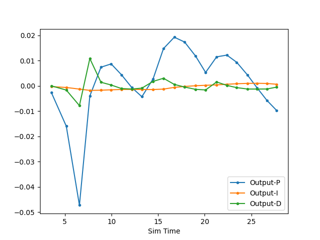
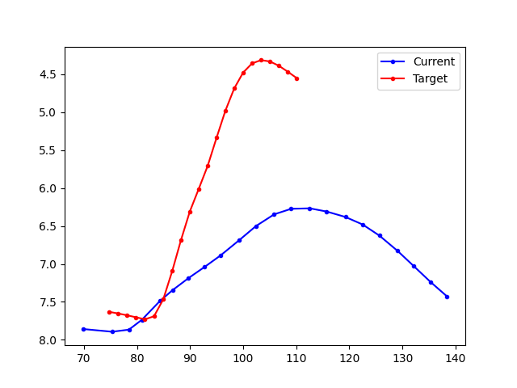

# Control and Trajectory Tracking for Autonomous Vehicle

# Proportional-Integral-Derivative (PID)

In this project, I was required to to design a PID controller to perform vehicle trajectory tracking. The controller was implemented in C++ and tested using [CARLA](https://carla.org/).

## Using CARLA on the Workspace
As the cycle time of the CARLA backend was very high (> 1 seconds), it was very difficult to design a controller with acceptable performance. For example, the car will stop within 2 computation cycles if the controller had a more dynamic parameter set.

## Velocity Controller

At first, I had to setup the velocity controller. It was required to use the last element of the velocity profile as target. The following images depict different signal plots. The target speed (red) was constant for the whole scene.
The vehicle's speed (purple) is quite noise in the beginning. However, the speed smoothly reaches the target afterwards. 

The other plot shows how each component of the PID controller contributes to the total
output. To reach the target value, the integral component is taken into account as the other components are close to zero.

## Steer Controller

To compute the error of the steer controller, I tried different approaches:
* The angle between the current vehicle orientation and angle between the current vehicle position and the final point of the planned trajectory

* The lateral distance between the longitudinal axis of the vehicleand the final position of the planned trajectory

* The lateral distance between the vehicle position and the last segment of the planned trajectory

None of the above held decent results until I noticed that the car position surpassed the final point of the planned trajectory which led to unexpected results for the error value. For example, the first approach will lead to errors greater 90 degrees as the yaw and the displacement point to opposite directions. In the end, I sticked to the angle approach and handled the case where the system surpassed the planned trajectory.

## What is the effect of the PID according to the plots, how each part of the PID affects the control command?

* The P-element applies a proportional control value based on an error. In our case, the error is the difference for example the difference between the target speed and the actual speed of the car. Larger differences will lead to higher controller output. This means using a high parameter value for the P-element will make the controller quicker. However, the system is likely to overshoot and oscillate around the setpoint.

* The D-element takes into account the rate of change between the current and previous error (D: derivative). Increasing its parameter will reduce overshoot of the controlled process variable. However, the system will need more time to reach the set point.

* The I-part applies a control value based on the integral of the error over time. This part of the controller is useful to overcome offsets to the set point as the error integral will increase over time.

## How would you design a way to automatically tune the PID parameters?

According to the course, one approach is *Twiddle* to minimize the error of controllers.

## PID controller is a model free controller, i.e. it does not use a model of the car. Could you explain the pros and cons of this type of controller?

* PID controller: Simple to use and tune. Very efficient with decent results if a suitable control variable is found.

* A model-based controller is more complex as suitable equations have to be derived first. Those equations will likely require more computational effort (e.g. matrix operations). However, I think model-based controllers are mandatory for multi-variable systems as the different system state variables are coupled and influence each other. This complexity can't be taken into account in a PID controller. In addition, a model-based approach considers physical limits of the system.

## What would you do to improve the PID controller?

* For real time systems, increase the frame rate of the system
* Use a different controller approach for the steering error (e.g. use lateral distance as error or a combination)
* Don't only use the final sample of the trajectory/speed profile as set point
* Use a model-based controller for the steering
